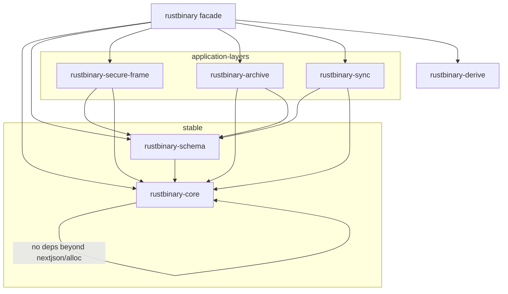

# Target crate architecture

The repository currently ships one runtime crate (`rustbinary`) plus the
`rustbinary-derive` proc-macro crate. The target architecture splits the
runtime into five crates along the existing feature/layer boundaries, with the
main `rustbinary` crate becoming a facade that re-exports the stable layers.
This document is the single source of truth for the split: the boundaries, the
dependency direction, and the migration order.

## Target crate graph

Dependency rule: **edges point downward only**. `core` depends on nothing
internal; `schema` depends on `core`; the three application layers depend on
`core` (and `schema` where they need reflection/bounds); the facade depends on
everything and owns the versioned re-exports.

## Crate responsibilities

| Crate                  | Owns                                                                  | Moves from today's            |
| ---------------------- | --------------------------------------------------------------------- | ----------------------------- |
| `rustbinary-core`      | `config`, `error`, `tags`, `canonical`, `ser`, `decoder`, `writer`, `core` | `src/{config,error,tags,canonical,ser,decoder,writer,core}.rs` |
| `rustbinary-schema`    | `schema` (fingerprint), `reflection`, `static_size`, `bounded`, `evolution`, `bitpack` | `src/{schema,reflection,static_size,bounded,evolution,bitpack}.rs` |
| `rustbinary-secure-frame` | `cbor`, `compression`, `encryption`, `trust`, `pipeline`, `parallel`, `frame` | `src/{cbor,cbor_codec,compression,encryption,trust,pipeline,parallel,frame}.rs` |
| `rustbinary-archive`   | `archive` (Merkle storage)                                            | `src/archive.rs`              |
| `rustbinary-sync`      | `rans` (entropy), `delta`, `ibl`                                      | `src/{rans,delta,ibl}.rs`     |
| `rustbinary` (facade)  | versioned re-exports, `options()`/`legacy_options()`, top-level fns   | `src/lib.rs`                  |
| `rustbinary-derive`    | all proc macros (`Nson` re-export kept external; `Fingerprint`, `StaticSize`, `Reflect`, `BitPacked`, `DecodeBounded`) | `rustbinary-derive/` |

`projection` is a protocol format, not a layer: it lands in
`rustbinary-secure-frame` (it is a self-authenticating frame format) or stays
facade-owned behind the `projection` feature; both are consistent with the
graph above as long as it only depends on `core`.

## Constraints that shape the split

1. **Derive paths.** The derive crate emits `::rustbinary::...` paths today.
   After the split it must emit `::rustbinary_core::...` / `::rustbinary_schema::...`
   for runtime traits and keep `::rustbinary::` only for facade-level
   re-exports. The generated code must resolve identically for `no_std`
   consumers, so the target crates must be `no_std + alloc` where today's
   modules are.
2. **Feature matrix.** Features today are per-capability (`cbor`,
   `compression`, ...). After the split each capability becomes a feature of
   its owning crate, and the facade re-maps the old feature names so
   `rustbinary = { features = ["cbor"] }` keeps working.
3. **Kani.** `kani_proofs` moves with `core` (canonical), plus harnesses in
   `schema` (bounded algebra) and `secure-frame` (projection geometry).
4. **Archive's blake3.** `archive` hashes with the in-tree `crate::hash`
   BLAKE3 implementation; if the archive is ever split into its own crate,
   the hash module moves with it and `core` stays hash-free.
5. **No behavior change.** The split is a packaging change. The wire bytes,
   the error types, the limits, and the test vectors are identical before and
   after each migration step.

## Migration order (each step keeps the full suite green)

1. **Extract `rustbinary-core`.** Move the six core modules verbatim; keep a
   `pub use` re-export in the facade so every internal `crate::` path keeps
   working during the step (mechanical, single commit).
2. **Extract `rustbinary-schema`.** Move fingerprint/reflection/static_size/
   bounded/evolution/bitpack; introduce `rustbinary_schema` as a dependency of
   the facade; update the derive crate's emitted paths for these traits.
3. **Extract `rustbinary-secure-frame` and `rustbinary-archive`.** These have
   the fewest cross-links; move them together.
4. **Extract `rustbinary-sync`.** rANS/delta/IBLT depend on `core` error types
   and `schema` reflection; move last because it has the most feature
   couplings (`entropy` requires `reflection`, etc.).
5. **Facade thinning.** After all five exist, remove the in-facade module
   bodies and keep only the versioned re-exports, `options()`, and the
   top-level functions. Update `rustbinary-bench`, `fuzz`, the examples, and
   the CI feature matrix to the new crate/feature names.

## Why not one commit

A one-shot mechanical split would move ~15 modules across five crates,
rewrite every `crate::` path and every derive-emitted path, and re-map the
whole feature matrix in a single change. Any error in that change is
indistinguishable from a regression, and the 91-test library suite plus the
9-example, 5-job CI matrix would all fail at once. The staged order above
keeps every step green and reviewable, and each step is independently
reversible.
